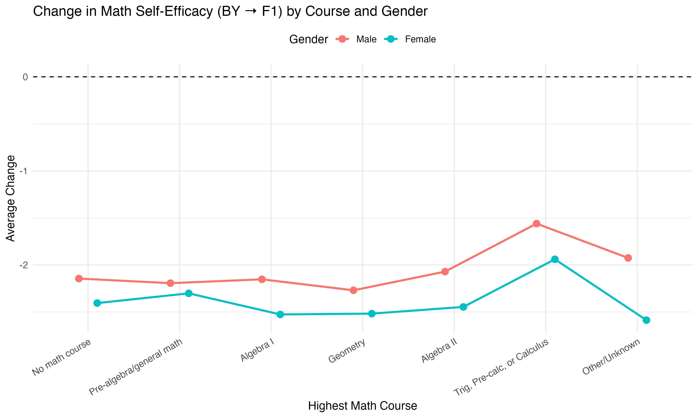

```{r setup, include=FALSE}
knitr::opts_chunk$set(echo = TRUE, message = FALSE, warning = FALSE, fig.align="center")
set.seed(2025)

library(dplyr); library(tidyr); library(ggplot2); library(readr)
library(knitr); library(kableExtra); library(broom)
```

# 1. Introduction

This notebook demonstrates the full workflow of my senior thesis project: “Mathematics Requirements, Self-Efficacy, and the Gender Gap in STEM.”

The project investigates whether increasing high school math graduation requirements affects students’ mathematical self-efficacy, and whether these effects differ by gender.

Why it matters:

-   Women remain underrepresented in mathematics-intensive fields (engineering, computer science, physics).

-   Confidence, rather than ability, often drives persistence in STEM.

-   Educational policy (like raising math requirements) provides a natural experiment to study causal impacts.

# 2. Data & Methodology

I use *ELS:2002* student panel survey data.

-   Sample: \~16,000 10th graders in 2002, followed through high school and into early adulthood.

-   Outcomes: math self-efficacy (Grade 10 & 12), math scores, advanced course-taking, and college major choice

-   Treatment: state-level requirements of **2 vs 3 years** or **3 vs 4 years** of high school math.

-   Approach: **Difference-in-Differences (DiD)** with **Propensity Score Matching (PSM)**.

```{r}
# Project pipeline: scripts auto-generate analysis-ready outputs
source("scripts/01_cleaning.R")
source("scripts/02_eda.R")
source("scripts/03_matching.R")
source("scripts/04_did.R")
```

# 3. Cleaning

What I did in **`01_cleaning.R`:**

-   Recode survey missing values (e.g., -9 → NA).

-   Build indices: challenge scales, growth mindset.

-   Rename variables for clarity (e.g., `math_score_by`, `math_self_efficacy_f1`).

-   Create demographic/SES features (gender, income quartiles, parent ed buckets, urbanicity).

-   Define treatment/control samples for **2v3** and **3v4**.

-   Reshape into long panel format (BY vs F1) for DiD.

-   Save clean datasets under `data/cleaned/`.

```{r}
df_2v3 <- readRDS("data/cleaned/df_2v3.rds")
df_3v4 <- readRDS("data/cleaned/df_3v4.rds")

cat("2v3 sample size:", nrow(df_2v3), "\n")
cat("3v4 sample size:", nrow(df_3v4), "\n")

```

# 4. Exploratory Data Analysis (EDA)

After cleaning, I explore the sample to understand demographics, baseline outcomes, and course-taking patterns.

## 4.1 Demographics

Weighted descriptives by requirement group (2, 3, 4 years).

```{r}
cat(readLines("output/tables/demo_table.tex"), sep="\n")
```

## 4.2 Baseline Outcomes Challenge indices & growth mindset.

cat(readLines("output/tables/outcome_table.tex"), sep="\n") 4.3

## 4.3 Course-Taking Patterns Highest Math Course by Requirement Years 

Base-Year Math Score by Course


Gender Distribution by Course


Change in Self-Efficacy by Course & Gender



Self-Efficacy by Ability Decile and Gender knitr::include_graphics("output/figures/efficacy_by_decile_gender.png")

Takeaways:

-   Higher-requirement states push more students into Algebra II / Pre-calc.

-   Gender gaps persist in course-taking and confidence trajectories.

-   Students in higher math-score deciles show stronger gains in self-efficacy.

# 5. Matching

To reduce baseline imbalance, we use **Propensity Score Matching (PSM):**

-   **2v3:** Full matching

-   **3v4:** Nearest-neighbor matching (ratio = 3)

-   Run with/without gender covariates.

5.1 Balance Diagnostics

```{r}


```

5.2 Balance Tables

```{r}
readr::read_csv("output/tables/balance_2v3_with_gender.csv", show_col_types = FALSE) %>%
  head(10) %>%
  kable(caption="Balance summary (2v3, with gender)") %>%
  kable_styling(full_width=FALSE)
```

# 6. Difference-in-Differences (DiD)

```{r}
did_files <- list.files("output/tables", pattern="^did_results_.*\\.csv$", full.names=TRUE)
readr::read_csv(did_files[1], show_col_types = FALSE) %>%
  kable(digits=3, caption="Sample DiD Results (2v3 with gender)") %>%
  kable_styling(full_width=FALSE)
```

Visual Check:

```{r}
knitr::include_graphics("output/figures/efficacy_by_decile_gender.png")
```

# 7. Interpretation

**Findings:**

-   The effect of stricter math requirements on **self-efficacy is heterogeneous**.

-   For women, moving from 2 → 3 years sometimes **lowers confidence**, while 3 → 4 years may help recovery.

-   Suggests **policy design matters**: a single extra year can discourage, but two years of advanced math can encourage.

**Implications:**

-   Simply raising requirements may not be enough — supportive classroom environments and stereotype threat reduction are critical.

-   Policy should focus not only on course-taking, but also on **student confidence**.
